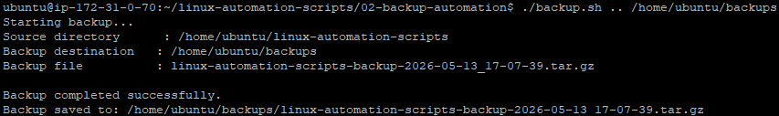

# Backup Automation Script

A Bash script that creates compressed backups of a selected directory using `tar`.

## Project Metadata

**Author:** Joemar Catipon  
**Repository:** Linux Automation Scripts  
**Environment:** AWS EC2 Ubuntu Linux  
**Instance Type:** t3.micro

## Description

This script automates directory backups by compressing a selected folder into a timestamped `.tar.gz` file.

The script supports both relative and absolute source paths. It also accepts an optional custom backup destination. If no destination is provided, the script saves the backup inside a default `backups` folder.

## Features

- Accepts a source directory as an argument
- Supports relative paths such as `..`
- Supports absolute paths such as `/home/ubuntu/project-folder`
- Accepts an optional custom backup destination
- Creates the backup destination folder if it does not exist
- Generates timestamped backup filenames
- Creates compressed `.tar.gz` backup files
- Displays clear success or error messages

## Technologies Used

- Bash
- Linux
- Ubuntu
- AWS EC2
- tar

## Commands Used

```bash
mkdir
tar
date
basename
dirname
realpath
```

## How to Run

Go to the project folder:

```bash
cd ~/linux-automation-scripts/02-backup-automation
```

Make the script executable:

```bash
chmod +x backup.sh
```

Run the script:

```bash
./backup.sh <source-directory> [backup-destination]
```

Arguments:

```text
<source-directory>      Required. The directory you want to back up.
[backup-destination]   Optional. The folder where the backup file will be saved.
```

## Example Usage

```bash
~/linux-automation-scripts/02-backup-automation$ # current directory
 ./backup.sh .. /home/ubuntu/backups # command used
```

This backs up `/home/ubuntu/linux-automation-scripts` and saves the backup file inside `/home/ubuntu/backups`.

## Example Output

```text
Starting backup...
Source directory      : /home/ubuntu/linux-automation-scripts
Backup destination   : /home/ubuntu/backups
Backup file          : linux-automation-scripts-backup-2026-05-14_16-30-00.tar.gz

Backup completed successfully.
Backup saved to: /home/ubuntu/backups/linux-automation-scripts-backup-2026-05-14_16-30-00.tar.gz
```

## Sample Output



## Project Structure

```text
02-backup-automation/
├── README.md
├── backup.sh
└── images/
    └── sample-output.png
```

## What I Learned

Through this project, I practiced:

- Writing Bash scripts with command-line arguments
- Handling relative and absolute paths
- Using optional arguments with default values
- Creating folders with `mkdir -p`
- Creating compressed backups with `tar`
- Adding timestamps to backup filenames
- Documenting a shell scripting project for a portfolio

## Notes

This project was developed and tested on an AWS EC2 Ubuntu Linux instance.

If no backup destination is provided, the script uses the default `backups` folder.
